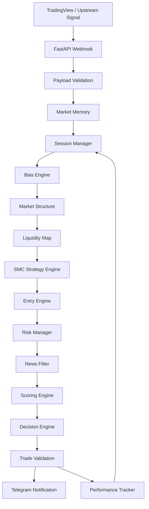

# System Architecture

## Overview

The Gold Trading Assistant is organized as a modular signal-analysis pipeline. The system does not place broker orders directly.

## Components

### FastAPI webhook
Receives a structured `WebhookPayload` and schedules the analysis pipeline as a background task.

### Market memory
Maintains current-day observations and previous-day high/low context. The current implementation is in-memory and intended to be upgraded to persistent market storage later.

### Session manager
Determines active UTC trading sessions and provides session behaviour/cooldown and volatility multipliers.

### Bias engine
Consumes upstream HTF bias/alignment information and determines whether the signal is directionally aligned.

### Market structure
Tracks BOS, CHoCH and HTF/LTF alignment flags supplied by the upstream signal.

### Liquidity map
Builds directional liquidity targets such as PDH, PDL, EQH, EQL and an internal fallback target.

### SMC strategy engine
Tracks liquidity sweeps, order blocks, FVG imbalance, inducement, displacement and sweep confirmation.

### Entry engine
Selects a candidate sniper, confirmation or market entry and rejects an unconfirmed BOS without displacement.

### Risk manager
Calculates SL/TP/TP2 around the actual entry, enforces direction consistency and ensures a minimum R:R threshold.

### News filter
Uses an explicit upstream news decision when provided. It deliberately does not generate fake/random economic-calendar events.

### Scoring and decision engines
Combine structure, liquidity, strategy, session, SMC confluence and adaptive telemetry into a bounded score with a traceable set of components.

### Telegram service
Sends approved analysis and rejection/error notifications.

### Performance tracker
Records accepted signals, resolves basic outcomes from subsequent prices, and derives lightweight telemetry used by the session/scoring layers.

## Data flow contract

The upstream TradingView/Pine layer should supply the market facts it has already detected, while the backend is responsible for validation, enrichment, filtering and decision formatting.

This separation keeps the backend testable and avoids pretending that a webhook-only service has access to OHLCV history it was never given.
